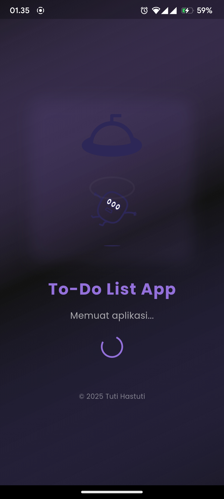
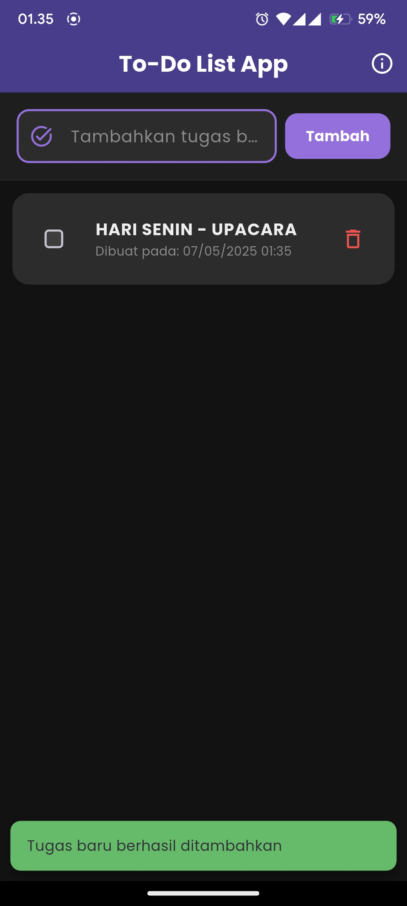
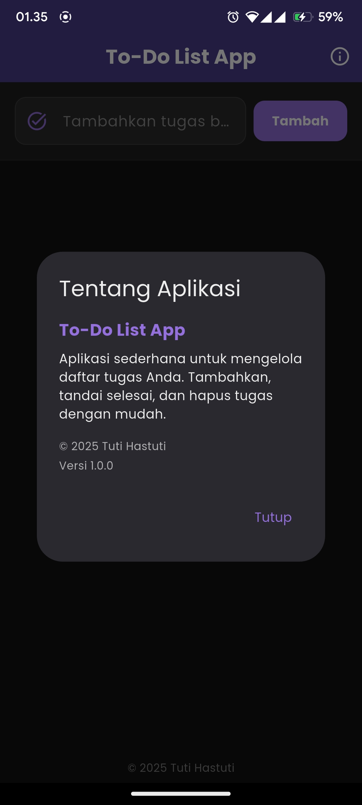
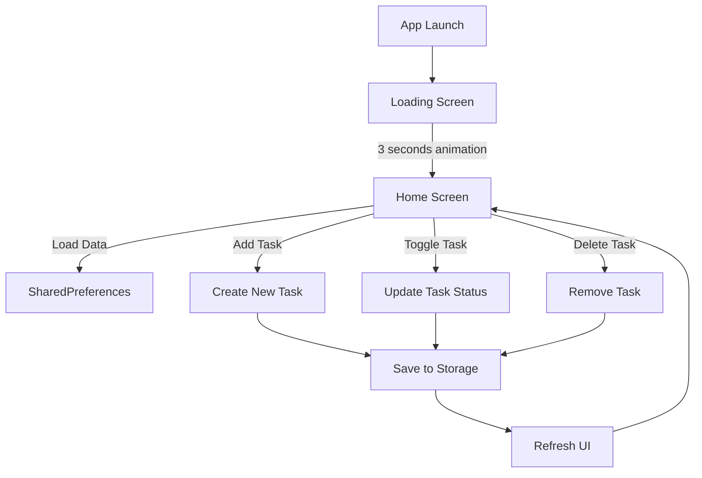

<div align="center">

# ✨ To-Do List App Flutter ✨


[](https://flutter.dev)
[](https://dart.dev)
[](LICENSE)
[](https://github.com/dasaraul/Aplikasi-ToDo-List/pulls)
[](https://github.com/dasaraul/Aplikasi-ToDo-List/stargazers)

**Aplikasi manajemen tugas yang elegan dengan animasi dinamis dan desain minimalis**

[Fitur](#fitur) • 
[Screenshots](#screenshots) • 
[Demo](#demo) • 
[Instalasi](#instalasi) • 
[Struktur](#struktur) • 
[Teknologi](#teknologi) • 
[Contributor](#contributor)

</div>

<br/>

<div align="center">


*Animasi Aplikasi To-Do List*

</div>

<br/>

## 🚀 Fitur

<table>
  <tr>
    <td width="50%">
      <h3>🎨 UI Elegan</h3>
      <ul>
        <li>Desain minimalis dengan tema ungu-lavender</li>
        <li>Mode terang dan gelap otomatis</li>
        <li>Animasi transisi halus</li>
        <li>Loading screen dengan animasi Lottie</li>
      </ul>
    </td>
    <td width="50%">
      <h3>⚡ Core Functionality</h3>
      <ul>
        <li>Tambah, hapus, dan perbarui tugas</li>
        <li>Tandai tugas sebagai selesai dengan checkbox</li>
        <li>Swipe untuk menghapus tugas</li>
        <li>Penyimpanan lokal persisten</li>
      </ul>
    </td>
  </tr>
  <tr>
    <td width="50%">
      <h3>🔍 Detail Tugas</h3>
      <ul>
        <li>Tampilkan tanggal/waktu pembuatan tugas</li>
        <li>Tampilkan tanggal/waktu penyelesaian tugas</li>
        <li>Status visual yang jelas untuk tugas selesai/belum</li>
      </ul>
    </td>
    <td width="50%">
      <h3>🛠️ Technical Features</h3>
      <ul>
        <li>Penyimpanan data dengan SharedPreferences</li>
        <li>Arsitektur terstruktur dan terorganisir</li>
        <li>Performa responsif di berbagai ukuran layar</li>
        <li>Desain adaptif untuk berbagai perangkat</li>
      </ul>
    </td>
  </tr>
</table>

## 📱 Screenshots

<div align="center">



</div>

## Unduh Aplikasi

Anda dapat mengunduh versi terbaru aplikasi TaskFlow dari [halaman Releases](https://github.com/dasaraul/Aplikasi-ToDo-List/releases).

- [Download APK Terbaru](https://github.com/dasaraul/Aplikasi-ToDo-List/releases/latest)

## 🔧 Instalasi

<details>
<summary>Klik untuk melihat langkah-langkah instalasi</summary>

### Prasyarat

- [Flutter SDK](https://flutter.dev/docs/get-started/install) (versi 3.16.0 atau lebih tinggi)
- [Dart SDK](https://dart.dev/get-dart) (versi 3.0.0 atau lebih tinggi)
- Android Studio / VS Code dengan plugin Flutter
- Perangkat Android / iOS atau emulator

### Langkah-langkah

1. Clone repository
   ```bash
   git clone https://github.com/dasaraul/Aplikasi-ToDo-List
   ```

2. Masuk ke direktori proyek
   ```bash
   cd Aplikasi-ToDo-List
   ```

3. Install dependencies
   ```bash
   flutter pub get
   ```

4. Jalankan aplikasi
   ```bash
   flutter run
   ```

</details>

## 📂 Struktur Proyek

```
lib/
├── main.dart                 # Entry point & theme configuration
├── models/
│   └── todo_model.dart       # Data model for Todo Item
├── screens/
│   ├── loading_screen.dart   # Loading screen with Lottie animation
│   └── home_screen.dart      # Main screen with todo list
└── services/
    └── storage_service.dart  # Local storage service
```

## 🧩 Teknologi

<div align="center">

[](https://flutter.dev)
[](https://airbnb.design/lottie/)
[](https://pub.dev/packages/shared_preferences)
[](https://m3.material.io/)

</div>

## 📊 Alur Kerja Aplikasi



## 💻 Penjelasan Kode

<details>
<summary><b>1. Main.dart - Konfigurasi Tema & Entry Point</b></summary>

```dart
void main() {
  WidgetsFlutterBinding.ensureInitialized();
  runApp(const MyApp());
}

class MyApp extends StatelessWidget {
  const MyApp({Key? key}) : super(key: key);

  @override
  Widget build(BuildContext context) {
    return MaterialApp(
      // Theme configuration with lavender-purple color scheme
      theme: ThemeData(
        colorScheme: ColorScheme.fromSeed(
          seedColor: const Color(0xFF6A5ACD), // Slate Blue
          brightness: Brightness.light,
          // More theme configurations...
        ),
        // Other theme properties...
      ),
      darkTheme: ThemeData(/* Dark theme configuration */),
      themeMode: ThemeMode.system,
      home: const LoadingScreen(),
    );
  }
}
```
</details>

<details>
<summary><b>2. TodoItem Class - Model Data</b></summary>

```dart
class TodoItem {
  String id;
  String judul;
  bool selesai;
  DateTime? tanggalDibuat;
  DateTime? tanggalSelesai;

  TodoItem({
    required this.id,
    required this.judul,
    this.selesai = false,
    DateTime? tanggalDibuat,
    this.tanggalSelesai,
  }) : this.tanggalDibuat = tanggalDibuat ?? DateTime.now();

  // JSON conversion methods
  factory TodoItem.fromJson(Map<String, dynamic> json) { /* ... */ }
  Map<String, dynamic> toJson() { /* ... */ }
  
  // Create copy with changes
  TodoItem copyWith({ /* ... */ }) { /* ... */ }
}
```
</details>

<details>
<summary><b>3. Loading Screen - Animasi Lottie</b></summary>

```dart
class _LoadingScreenState extends State<LoadingScreen> {
  bool _isLoading = true;

  @override
  void initState() {
    super.initState();
    
    // Timer for loading simulation
    Timer(const Duration(seconds: 3), () {
      if (mounted) {
        setState(() { _isLoading = false; });
        Navigator.of(context).pushReplacement(
          MaterialPageRoute(builder: (context) => const HomeScreen()),
        );
      }
    });
  }

  // Build method with Lottie animation
  @override
  Widget build(BuildContext context) {
    // Display Lottie animation and loading text
    // ...
  }
}
```
</details>

<details>
<summary><b>4. Home Screen - CRUD Operations</b></summary>

```dart
class _HomeScreenState extends State<HomeScreen> {
  // Properties and controllers
  final TextEditingController _todoController = TextEditingController();
  List<TodoItem> _todoItems = [];
  final StorageService _storageService = StorageService();
  final Uuid _uuid = const Uuid();
  bool _isLoading = true;

  // Load todos from storage
  Future<void> _loadTodos() async { /* ... */ }

  // Add new todo
  Future<void> _addTodo() async { /* ... */ }

  // Toggle todo completion status
  Future<void> _toggleTodoStatus(String id) async { /* ... */ }

  // Delete todo
  Future<void> _deleteTodo(String id) async { /* ... */ }

  // UI building methods
  // ...
}
```
</details>

<details>
<summary><b>5. Storage Service - Data Persistence</b></summary>

```dart
class StorageService {
  static const String _todosKey = 'todos_data';

  // Save todos to SharedPreferences
  Future<void> saveTodos(List<TodoItem> todos) async { /* ... */ }

  // Load todos from SharedPreferences
  Future<List<TodoItem>> loadTodos() async { /* ... */ }

  // Clear all todo data
  Future<void> clearTodos() async { /* ... */ }
}
```
</details>

## 🔮 Pengembangan Selanjutnya

<div align="center">

| Fitur | Deskripsi | Status |
|-------|-----------|--------|
| 🗂️ Kategori Tugas | Pengelompokan tugas berdasarkan kategori | Planned |
| 🔔 Notifikasi | Pengingat untuk tugas dengan deadline | Planned |
| ☁️ Cloud Sync | Sinkronisasi data dengan Firebase | Future |
| 🔍 Pencarian | Fitur pencarian dan filter tugas | Future |
| 📅 Kalender View | Tampilan kalender untuk tugas | Future |

</div>

## 👥 Contributor

<div align="center">
  <a href="https://github.com/dasaraul">
    
    <br />
    <sub><b>Tuti Hastuti</b></sub>
  </a>
</div>

## 📄 Lisensi

<div align="center">

Proyek ini dilisensikan di bawah [Lisensi MIT](LICENSE).

</div>

### MIT License

```
MIT License

Copyright (c) 2025 Tuti Hastuti

Permission is hereby granted, free of charge, to any person obtaining a copy
of this software and associated documentation files (the "Software"), to deal
in the Software without restriction, including without limitation the rights
to use, copy, modify, merge, publish, distribute, sublicense, and/or sell
copies of the Software, and to permit persons to whom the Software is
furnished to do so, subject to the following conditions:

The above copyright notice and this permission notice shall be included in all
copies or substantial portions of the Software.

THE SOFTWARE IS PROVIDED "AS IS", WITHOUT WARRANTY OF ANY KIND, EXPRESS OR
IMPLIED, INCLUDING BUT NOT LIMITED TO THE WARRANTIES OF MERCHANTABILITY,
FITNESS FOR A PARTICULAR PURPOSE AND NONINFRINGEMENT. IN NO EVENT SHALL THE
AUTHORS OR COPYRIGHT HOLDERS BE LIABLE FOR ANY CLAIM, DAMAGES OR OTHER
LIABILITY, WHETHER IN AN ACTION OF CONTRACT, TORT OR OTHERWISE, ARISING FROM,
OUT OF OR IN CONNECTION WITH THE SOFTWARE OR THE USE OR OTHER DEALINGS IN THE
SOFTWARE.
```

---

<div align="center">

**✨ Made with 💜 and Flutter ✨**

<p>© 2025 Tuti Hastuti. All rights reserved.</p>


</div>